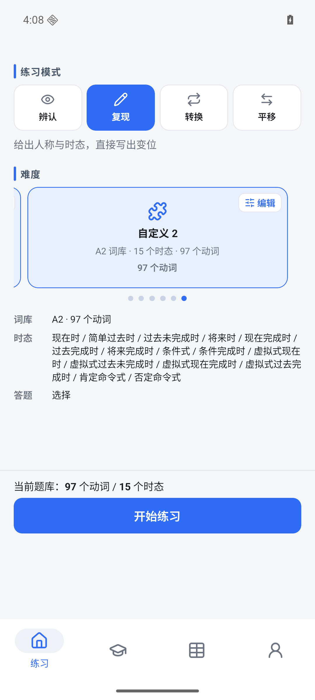
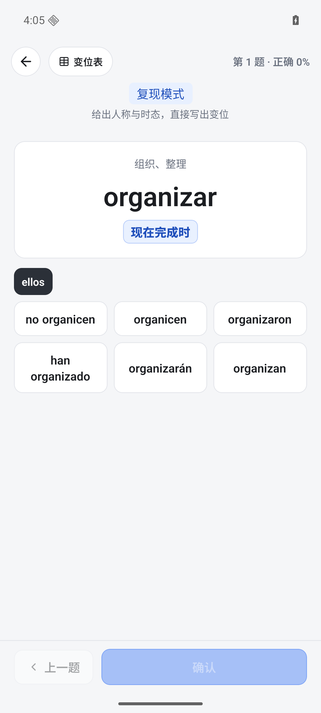
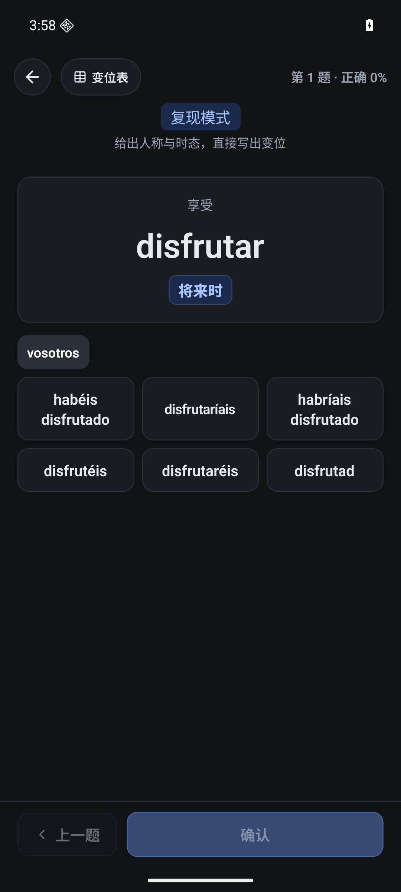
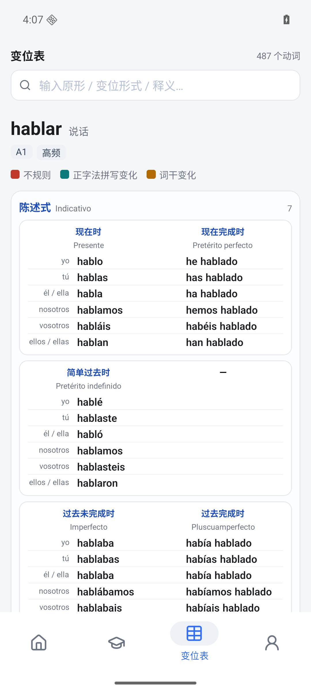
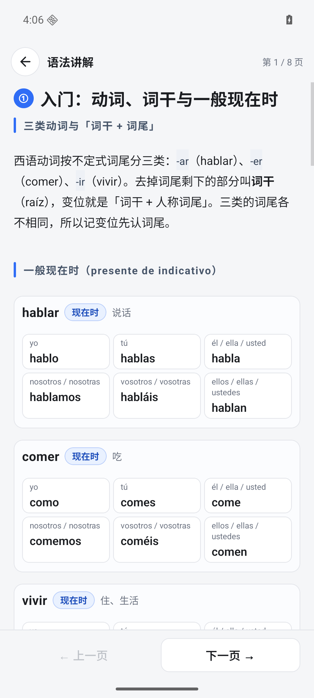
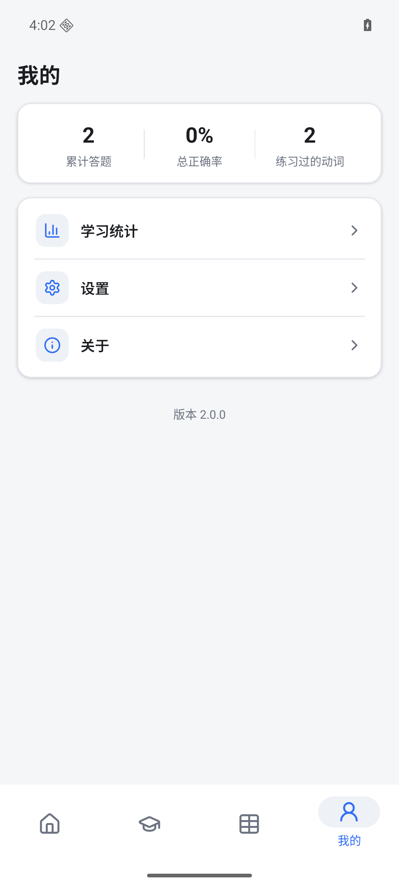
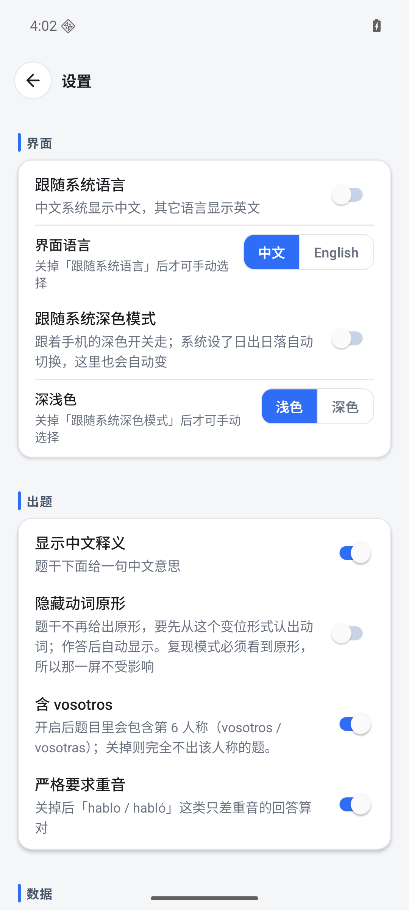
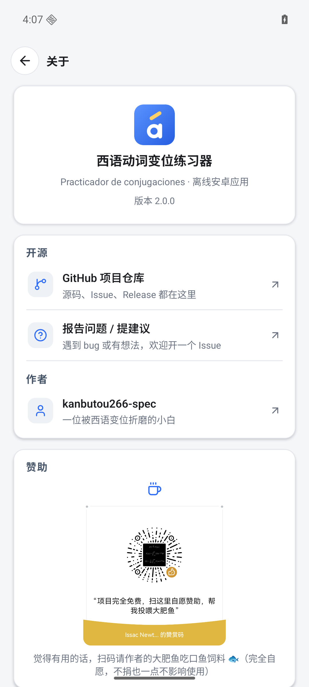

<h1 align="center">变位君 · 西语动词变位训练器</h1>

<p align="center">
  
</p>

<p align="center">
  <b>离线 · 无广告 · 无账号</b>&nbsp;｜&nbsp;487 动词 × 15 时态 × 4 种训练模式<br/>
  Android（React Native）· 与网页版功能对齐
</p>

<p align="center">
  <a href="https://github.com/kanbutou266-spec/Spanish-Verb-Conjugation-Trainer">
    
  </a>
</p>

<p align="center">
  
  &nbsp;
  <a href="README.en.md">
    
  </a>
</p>

**变位君**是一个离线的西班牙语动词变位训练 App，面向已经入门、正在跟变位表死磕的学习者：
487 个动词 × 15 个常用时态，四种练习模式、逐字符判分高亮，以及一份 8 页的变位规则讲解。

> 纯离线：无广告、无账号、不联网。词库与讲解全部打包进 APK。
> 另有一个功能对齐的[网页版](https://github.com/kanbutou266-spec/Spanish-Verb-Conjugation-Trainer)（单文件 HTML，双击即用）。

<p align="center">
  
  
  
</p>
<p align="center">
  
  
  
</p>
<p align="center">
  
  
  
</p>

---

## 💝 支持本项目

如果本项目对你有帮助，可以请作者的大肥鱼吃高级鱼饲料，所有赞助全部用于项目维护。

> 纯属自愿赞助，项目本身完全免费，不会因为不赞助而限制任何功能。

<p align="center">
  
</p>

---

## 功能

### 四种练习模式
| 模式 | 玩法 |
|---|---|
| **辨认** | 给一个变位形式，选出它的人称 + 时态 |
| **复现** | 给人称与时态，直接写出变位（核心模式） |
| **转换** | 给一个形式，写出同一时态的另一个人称 |
| **平移** | 在两个时态之间整体搬运一套人称 |

### 判分与反馈
- **逐字符高亮**：答错时用差异区间标出「错在哪几个字母」，而不是笼统的红叉；
  重音符号（á é í ó ú ñ）按用户设置可以要求严格一致。
- **同形多读法**：像 `hablé` 这种只有一个读法的答案之外，凡一个形式对应多条规则
  （如 `-amos` 同时是现在时 nosotros 和命令式 nosotros）都算对。
- 做错的题进入**学习统计**，可以看正确率趋势与最常错的动词。

### 变位表
按动词查询全部时态，一对经常成对出现的时态（现在时/现在完成时、简单过去时/过去完成时…）
并排一卡，方便对照记忆；支持按原形、变位形式、中文释义搜索。

### 其它
- **中英双语界面**，跟随系统语言，也可在设置里手动切换；
- **深浅色三档**（跟随系统 / 浅色 / 深色），全套配色双主题逐值对齐；
- **难度轮播**：A1/A2/B1 词库预设 + 自定义槽（自选词库、时态、答题方式）；
- 学习进度、设置存本地（zustand persist），可导出 JSON 备份/迁移。

---

## 技术栈

- **React Native 0.86 + Expo SDK 57**（expo-router 文件路由，TypeScript）
- 状态：**zustand** + persist（AsyncStorage）
- 图标：**lucide-react-native** 栅格化为 PNG（`scripts/gen-tab-icons.mjs`）
- 测试：**jest + jest-expo + RNTL v14**，746 条用例 / 35 个套件
- 引擎层 `src/engine/` 是**零 UI、零全局变量**的纯函数集合，全部单测覆盖

```
src/
├── app/            # expo-router 路由：(tabs) + practice / settings / about ...
├── components/     # 跨页面组件（底栏 tab、开屏品牌页）
├── config/         # 品牌常量（仓库地址、版本号，换仓库只改这里）
├── data/           # 词库 verbs.json（487 动词，紧凑格式）+ 讲解 guide.ts（生成）
├── engine/         # 出题 / 判分 / 高亮 / 搜索 / 讲解解析 —— 纯函数，零 UI
├── i18n/           # 中英双语文案（各 271 条，键数有测试把关）
├── store/          # zustand：设置 / 统计 / 自定义槽
├── ui/             # 主题令牌（双主题调色板）+ 基础组件库
└── utils/
```

### 与网页版的关系
本仓库是[同一项目的安卓版](https://github.com/kanbutou266-spec/Spanish-Verb-Conjugation-Trainer)。
两条铁律：

1. **词库与讲解逐字一致** —— `src/data/verbs.json` 直接来自网页版的数据管道；
   `src/data/guide.ts` 由 `node scripts/extract-guide.mjs` 从网页版模板抽取生成，**不要手改**。
2. **UI 值照抄网页版 CSS** —— 主题令牌、间距、字号都以网页版为口径；
   `__tests__/ui/no-hardcoded-colors.test.ts` 会扫描全仓库，禁止写死颜色。

---

## 本地运行

需要 **Node 18+**、**JDK 17**、Android SDK（Android Studio 装好即可）。

```bash
npm install
npm start            # 启动 Metro，按 a 打安卓模拟器
```

其它常用命令：

```bash
npm run android      # 编译并安装到模拟器/真机（开发版）
npm test             # jest 全量回归（746 条）
npm run typecheck    # tsc --noEmit
npm run lint         # expo lint
```

## 打包 APK

```bash
build-apk.cmd        # Windows 双击即可
npm run android:apk  # 等价命令行：cd android && gradlew assembleRelease
```

产物：

- `android/app/build/outputs/apk/release/app-release.apk`
- `BianWeiJun-release.apk`（项目根目录的副本）

release 包**内嵌 JS bundle**，装到手机后不需要 Metro，可直接离线运行。
安装：`adb install -r BianWeiJun-release.apk`。

**签名说明**：目前用 RN 模板自带的公开 debug keystore 签名（密码就是 `android`，
已随仓库提交，保证克隆下来能直接打包）。仅自用 / 分发 APK 够用；
要上架 Google Play 需换成自己的正式 keystore —— 在 `android/app/build.gradle`
的 `signingConfigs` 里替换，并**不要**把新 keystore 提交进仓库（`.gitignore` 已挡 `*.jks` / `*.keystore`）。

> ⚠️ **改了 `src/` 下的任何 JS 后再打包，必须先清两个 bundle 缓存目录**，
> 否则 Gradle 会复用旧 bundle 而不报错（`createBundleReleaseJsAndAssets`
> 不追踪 JS 源码变化）：
>
> ```bash
> rm -rf android/app/build/generated/assets/react android/app/build/intermediates/assets
> ```
>
> `build-apk.cmd` 已经内置这一步。

### APK 体积（2026-10-08 优化，108.9 MB → 16.7 MB）

默认配置打出来的包曾高达 109 MB，做了四层裁剪后降到 **16.7 MB**（arm64-v8a）：

| 手段 | 改动位置 | 收益 |
|---|---|---|
| 只保留 `arm64-v8a` | `android/gradle.properties` 的 `reactNativeArchitectures` | -61 MB（四个架构各带一份完全相同的 RN/Hermes；x86/x86_64 只有模拟器用，armeabi-v7a 是 2017 年前的 32 位机） |
| R8 代码压缩 + 资源压缩 | `android.enableMinifyInReleaseBuilds` / `android.enableShrinkResourcesInReleaseBuilds` | dex 15 → 6 MB |
| 原生库 deflate 压缩 | `expo.useLegacyPackaging=true` | .so 22 → 7 MB（代价：安装后占用略大，安装时多一步解压） |
| 只保留中/英资源 | `android/app/build.gradle` 的 `resourceConfigurations` | resources.arsc 1.6 → 0.6 MB |
| 关闭 GIF/WebP 解码器、压缩 JS bundle、移除未用依赖 | `expo.gif.enabled=false`、`expo.webp.enabled=false`、`android.enableBundleCompression=true`、移除 `@react-native-community/slider` | -3.5 MB |

注意：

- **在模拟器上验收时要覆盖 ABI**（模拟器是 x86_64）：
  `cd android && gradlew assembleRelease -PreactNativeArchitectures=x86_64`
- 若 R8 混淆后出现「类找不到 / 原生模块方法找不到」式崩溃，先把
  `android.enableMinifyInReleaseBuilds` 改回 `false` 定位，再到
  `android/app/proguard-rules.pro` 补 keep 规则（本轮开启后全流程验收通过）。
- `expo-symbols` 只在 web 版用过一次，已改用 lucide 图标 —— 它的安卓实现会往
  包里塞一个 966 KB 的 Material Symbols 字体。

## 图标与启动屏

图标（含自适应前景/单色层、5 档密度的 mipmap、系统启动屏 logo）全部由一个脚本生成，
**不要手改 `res/` 里的 PNG**：

```bash
node scripts/gen-app-icon.mjs
```

它会读 `assets/brand/*.svg` 矢量母版，渲染出 `assets/images/*` 并直接写进
`android/app/src/main/res/`。改设计就改这个脚本再重跑。
应用名「变位君」在 `app.json` 的 `expo.name` 和
`android/app/src/main/res/values/strings.xml` 的 `app_name` **两处**，要一起改。

## 项目约定

- **引擎层零 UI**：`src/engine/` 只写纯函数、显式收参，不 import 任何组件 —— 这是 746 条
  测试能跑得快的前提。
- **文案不许硬编码**：一律走 `src/i18n/`（中/英两份键数必须相等，有测试断言）。
- **颜色不许写死**：一律走 `src/ui/theme.ts` 的调色板（有扫描测试）。
- 安卓底栏 tab 标签 ≤ 12 字符，长了原生底栏会把 tab 挤掉。

## 许可证

[MIT](LICENSE)

---

*¡Ánimo y a conjugar!* 🇪🇸
